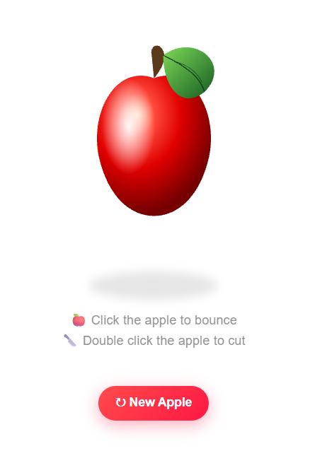

````markdown
# 🍎 Realistic Apple SVG

A realistic apple illustration created using **HTML, CSS, and SVG**. The project demonstrates how SVG vector graphics, gradients, lighting effects, leaf details, and shadows can be combined to create a visually appealing and scalable apple design.

---

## 📸 Project Preview

<p align="center">
  
</p>

---

## ✨ Features

- 🍎 Realistic Apple Design
- 🎨 Smooth SVG Gradients
- 💡 Realistic Shine and Lighting Effect
- 🍃 Detailed Leaf Design
- 🌑 Natural Shadow Effect
- 📱 Responsive and Scalable Design
- 🖼️ No External Image Assets Required

---

## 🛠️ Technologies Used

- **HTML5**
- **CSS3**
- **SVG**

---

## 📂 Project Structure

```text
apple-project/
│
├── static/
│   └── SVG_apple.png
│
├── index.html
├── style.css
└── README.md
````

---

## 🚀 How to Run

1. Download the project.
2. Open index.html in your browser.

---

## 🎯 Project Highlights

This project uses SVG to create a realistic apple illustration with:

* Gradient-based apple coloring
* Soft lighting and shine effects
* Realistic leaf and stem details
* Shadow effects for depth
* Scalable vector graphics

---

## 👩‍💻 Author

**Yuvashree**